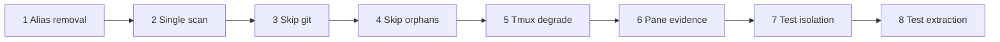

# PR #79 Review Plan — Optimization and Reliability

Review the eight commits in order. Each commit is scoped to one behavior change (or one test-only change) so you can approve incrementally without re-reading the full diff.

**Branch:** `ajax/optimization-and-reliability`  
**Base:** `main`  
**PR:** https://github.com/mossipcams/ajax-cli/pull/79

## Quick validation (full branch)

```sh
cargo fmt --check
cargo check --all-targets --all-features
cargo clippy --all-targets --all-features -- -D warnings
cargo nextest run --all-features
```

Focused checks per commit are listed below.

---

## Commit 1 — `refactor: remove rebuild_cockpit_view alias`

**Scope:** Delete the `rebuild_cockpit_view` wrapper; call `cockpit_view` directly.

| File | Why |
|------|-----|
| `crates/ajax-core/src/commands.rs` | Remove alias |
| `crates/ajax-cli/src/cockpit_backend.rs` | CLI cockpit refresh |
| `crates/ajax-web/src/runtime.rs` | Attention polling |
| `crates/ajax-web/src/slices/cockpit.rs` | PWA cockpit + task detail |

**Review focus**

- Confirm no remaining `rebuild_cockpit_view` references (`rg rebuild_cockpit_view`).
- Behavior should be identical: alias was a pure forwarder.

**Verify**

```sh
cargo check -p ajax-core -p ajax-cli -p ajax-web
rg rebuild_cockpit_view
```

---

## Commit 2 — `perf: reuse task snapshot during runtime refresh`

**Scope:** One registry scan per refresh; reuse `probe_task_ids` for tmux probing.

| File | Why |
|------|-----|
| `crates/ajax-core/src/runtime_refresh.rs` | Drop second `list_tasks()` before tmux loop |

**Review focus**

- `list_tasks()` should happen once at the start (plus any internal calls from git refresh).
- Orphan recovery test now expects exactly **2** registry scans (initial + git refresh), not “≤ 3”.

**Verify**

```sh
cargo nextest run -p ajax-core -- orphan_recovery_uses_one_registry_snapshot
```

---

## Commit 3 — `perf: skip git substrate refresh on fresh runtime polls`

**Scope:** `needs_git_substrate_refresh()` gates `refresh_git_substrate_evidence`; git errors propagate with `?`.

| File | Why |
|------|-----|
| `crates/ajax-core/src/runtime_refresh.rs` | Conditional git + new helper/test |

**Review focus**

- Steady-state active tasks with fresh `RuntimeProjection` should **not** run worktree/branch listing.
- Missing-substrate flags (`WorktreeMissing`, `BranchMissing`) must still force git refresh.
- Git adapter failures should surface as `CommandError`, not be swallowed.

**Verify**

```sh
cargo nextest run -p ajax-core -- steady_state_refresh_skips_git_substrate_commands
```

---

## Commit 4 — `perf: skip orphan worktree discovery on steady-state polls`

**Scope:** `should_scan_for_orphan_worktrees()` skips orphan git discovery when all probe tasks have fresh projections.

| File | Why |
|------|-----|
| `crates/ajax-core/src/runtime_refresh.rs` | Orphan gate + test fixture tweak |

**Review focus**

- Provisioning tasks must still trigger orphan scan.
- Unknown / unobservable / stale projections must still trigger orphan scan.
- Orphan recovery test seeds a **stale** projection so discovery still runs when expected.

**Verify**

```sh
cargo nextest run -p ajax-core -- orphan_recovery
```

---

## Commit 5 — `fix: degrade tmux listing failures during runtime refresh`

**Scope:** Non-zero or failed `list-sessions` no longer aborts the whole refresh; empty session list allows degraded missing-session handling.

| File | Why |
|------|-----|
| `crates/ajax-core/src/runtime_refresh.rs` | Tmux match arms + failure test |

**Review focus**

- Spawn failure → empty sessions → task marked `TmuxMissing` (not silent no-op).
- Non-zero exit still returns early with prior `changed` state (git work preserved).
- Compare with pre-change behavior where tmux failure returned `Ok(false)` immediately.

**Verify**

```sh
cargo nextest run -p ajax-core -- tmux_probe_failure_marks_missing_session
```

---

## Commit 6 — `refactor: classify pane output with evidence-based parser`

**Scope:** Introduce `PaneEvidence` + `classify_recent_evidence`; keep Cursor stream-json helpers from main.

| File | Why |
|------|-----|
| `crates/ajax-core/src/live.rs` | Pane classification refactor |

**Review focus**

- `classify_line_evidence` tries Cursor JSON first, then text `pane_evidence`.
- Shell-prompt recency: only the line **before** the prompt is classified (not the prompt itself).
- Existing live.rs unit tests must still pass (approval, CI failed, merge conflict, cursor JSON fixtures).

**Verify**

```sh
cargo nextest run -p ajax-core live::
```

---

## Commit 7 — `test: pin integration profiles and harden smoke fake git`

**Scope:** Stop host `AJAX_PROFILE` from leaking into tests; smoke uses dev layout helpers.

| File | Why |
|------|-----|
| `crates/ajax-cli/tests/live_cli.rs` | Pin `AJAX_PROFILE=stable` via `base_command` |
| `crates/ajax-cli/tests/smoke_user_flows.rs` | Pin dev profile + `expected_worktree_path` + fake git handlers |

**Review focus**

- Live CLI tests must not inherit `AJAX_HOME` / dev profile from the environment.
- Smoke fake git must answer `worktree list --porcelain` and `branch --format` for dev paths under `{AJAX_HOME}/worktrees/...`.
- No production code changes in this commit.

**Verify**

```sh
cargo nextest run -p ajax-cli --test live_cli
cargo nextest run -p ajax-cli --test smoke_user_flows
```

Run without pinning env locally to confirm isolation:

```sh
env AJAX_PROFILE=dev cargo nextest run -p ajax-cli --test live_cli -- smoke_new_execute
```

---

## Commit 8 — `refactor: extract ajax-cli lib tests into lib/tests.rs`

**Scope:** Mechanical move of inline `mod tests` (~7.6k lines) to `src/lib/tests.rs`; test-only re-exports in `lib.rs`.

| File | Why |
|------|-----|
| `crates/ajax-cli/src/lib.rs` | Production shell + `#[path = "lib/tests.rs"]` |
| `crates/ajax-cli/src/lib/tests.rs` | All former inline tests |

**Review focus**

- Spot-check that `lib.rs` only adds test re-exports and the path module — no behavior changes.
- Optional: diff test count (`rg -c '#\[test\]'` should match pre-extraction count on main).
- This commit is large but should be **move-only**; skim for accidental edits in the first/last 50 lines.

**Verify**

```sh
cargo nextest run -p ajax-cli
wc -l crates/ajax-cli/src/lib.rs crates/ajax-cli/src/lib/tests.rs
```

---

## Suggested review order



Commits **1–5** are runtime/cockpit performance and reliability.  
Commits **6–8** are classification refactor and test hygiene.

## Risk summary

| Area | Risk | Mitigation in PR |
|------|------|------------------|
| Missed orphan tasks | Medium | Commit 4 keeps scan when provisioning/stale/unknown |
| Stale git evidence | Medium | Commit 3 refreshes when flags or projection require it |
| False tmux missing | Low | Commit 5 test + existing missing-session tests |
| Pane misclassification | Medium | Commit 6 preserves Cursor JSON path + existing live tests |
| CI env leakage | High (was failing CI) | Commit 7 explicit profile pinning |

## Per-commit checkout (optional)

To review one commit in isolation:

```sh
git fetch origin ajax/optimization-and-reliability
COMMIT=<sha-from-log>
git checkout $COMMIT
cargo nextest run --all-features
git checkout ajax/optimization-and-reliability
```

Replace `<sha-from-log>` with the commit under review (`git log --oneline origin/main..HEAD`).
